# Krankenkassen Prämien

- Entwicklung
- Franchisen
- Regionale Unterschiede

## Daten

* Aktuell: https://www.priminfo.admin.ch/de/downloads/aktuell
* Archiv: https://opendata.swiss/de/dataset/health-insurance-premiums
* Versicherer: https://www.bag.admin.ch/bag/de/home/versicherungen/krankenversicherung/krankenversicherung-versicherer-aufsicht/verzeichnisse-krankenundrueckversicherer.html

`00-loaddata.R` to download data
`01-data.R` to process data

Required edits:

* change `archive_urls` according to https://opendata.swiss/de/dataset/health-insurance-premiums
* change `current_url` and `current_files` according to https://opendata.swiss/de/dataset/health-insurance-premiums

### Bilanz und Erfolgsrechnung

Daten: https://www.bag.admin.ch/bag/de/home/versicherungen/krankenversicherung/krankenversicherung-versicherer-aufsicht/reporting/betriebsrechnungenundbilanzen.html

`10-loaddata_financials.R`

## Franchisen

`02-franchisen.R`

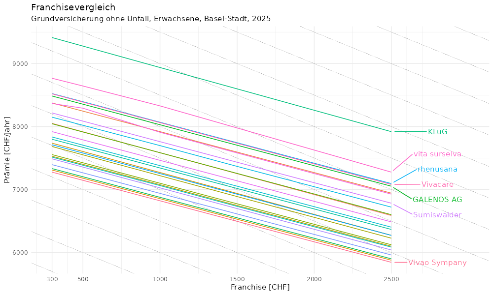

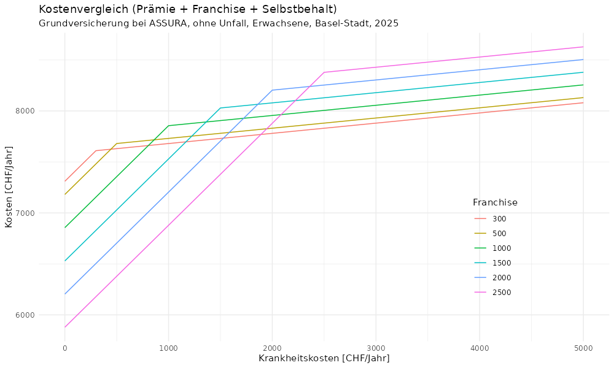

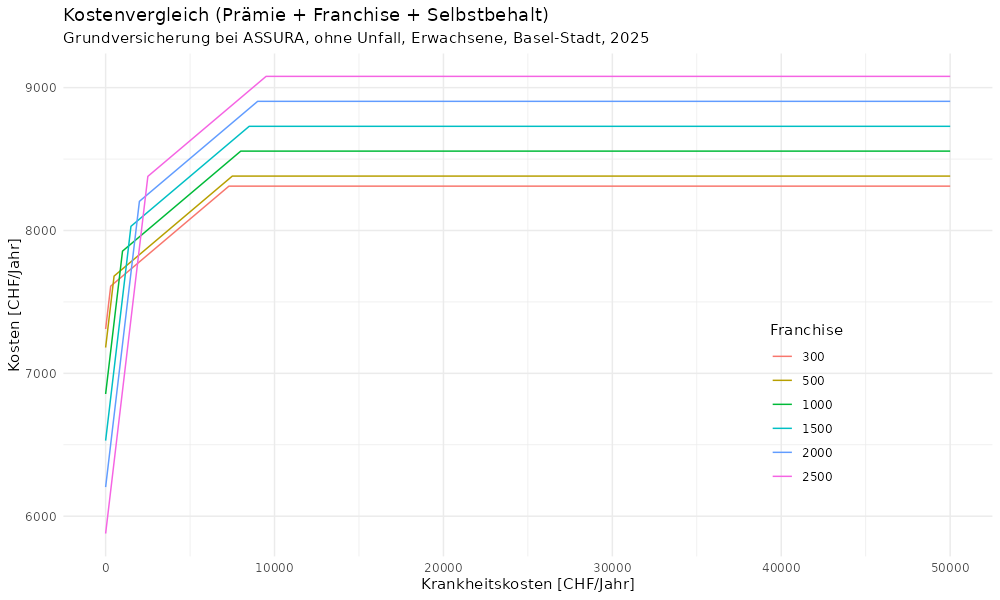

## Prämien

`03-praemien.R`

Billigste Versicherung in BS bei hoher Franchise (Erwachsene, ohne Unfall)?

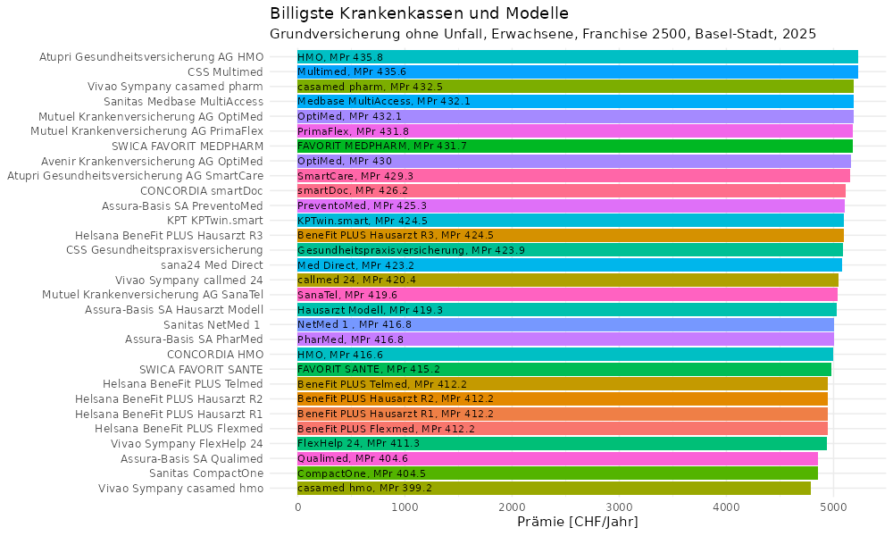

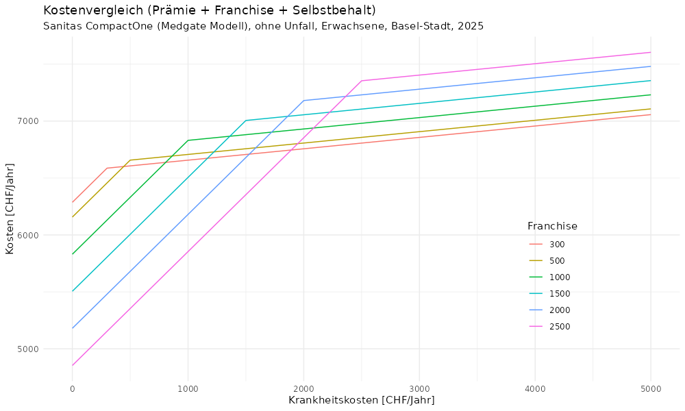

Kinder?

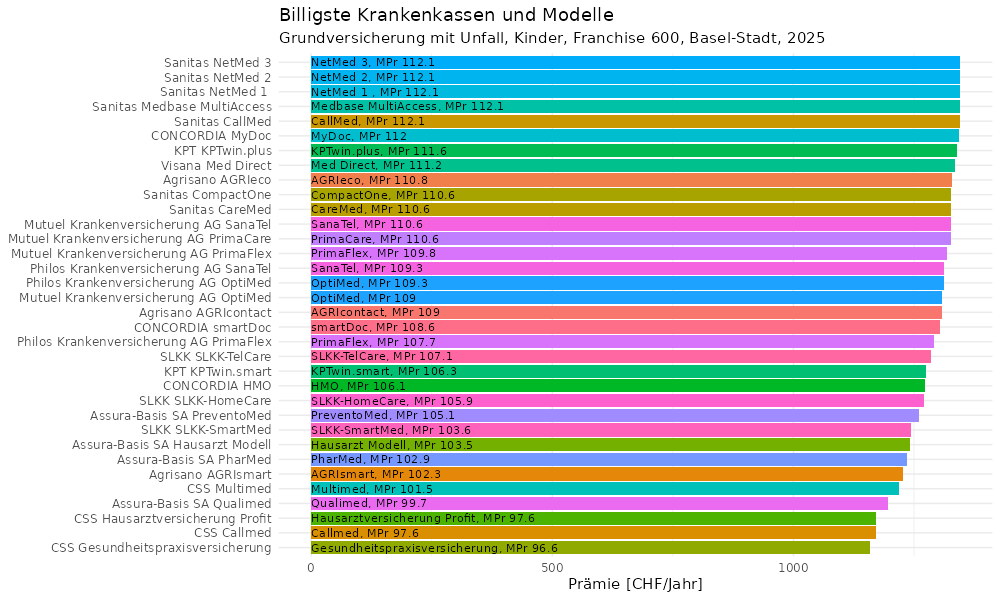

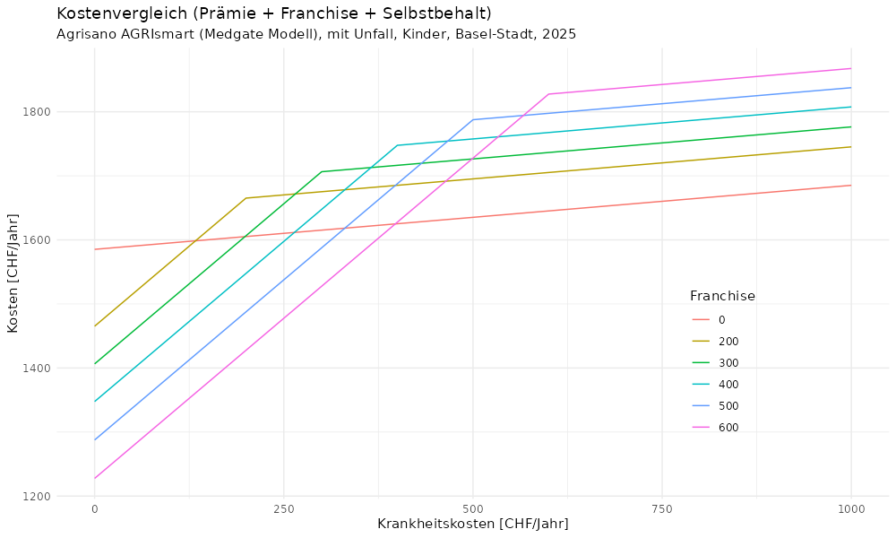

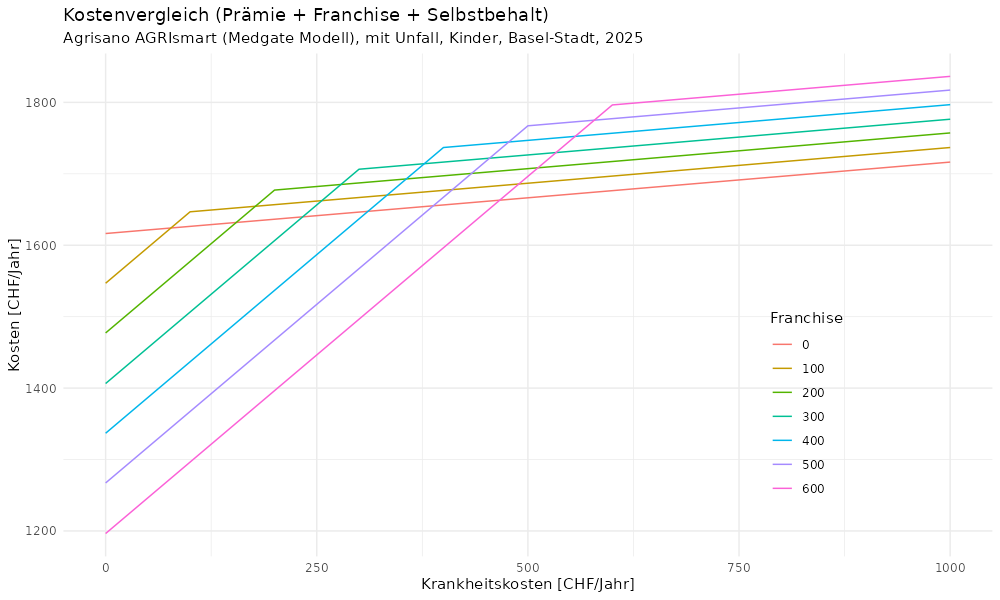

Unfall-Zusatz kostet im Schnitt rund 6.5% mehr. Warum aber Unfall bei Kinder? Was passiert wenn Kind verunfallt und kein Unfall-Zusatz abgeschlossen wurde?

## Versicherte

`04-versicherte.R`

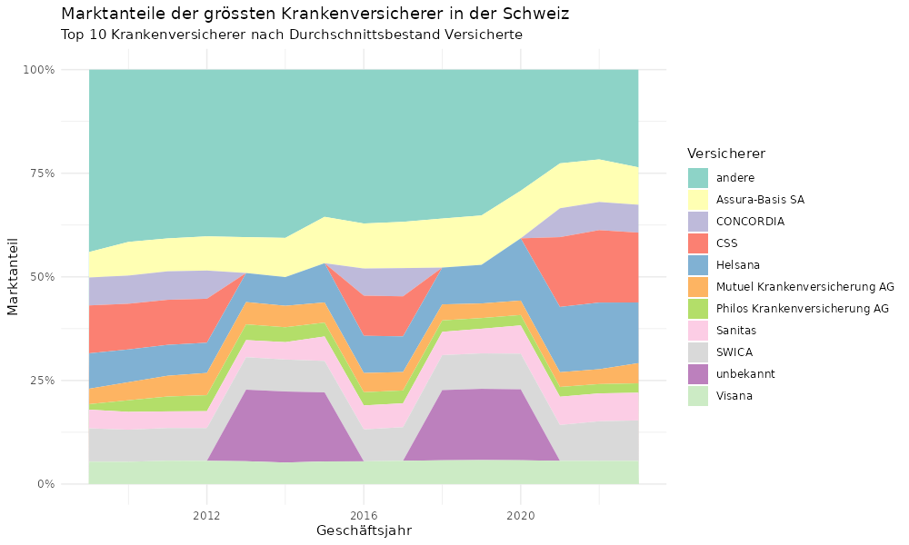

## Entwicklung Prämien

`05-entwicklung.R`

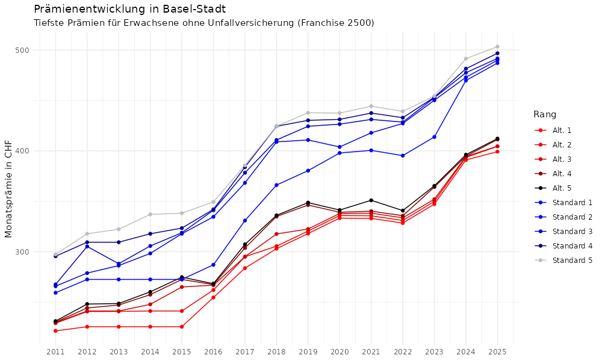

In Basel-Stadt ist die tiefste Prämie (Erwachsene, Franchise 2500, ohne Unfall, alle Modelle) von 2011 bis 2025 um 80% gestiegen. Die tiefste Standard Prämie gar um 88%. Dies entspricht 4.6% p.a.

Während stets Assura die tieste Prämie hatte, hat im 2025 erstmals Vivao Sympany die tiefste Prämie (Standard und andere mit casamed hmo, 2024 Mutuel).

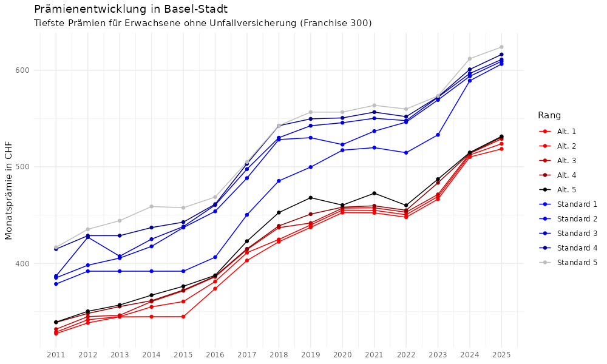

Die Steigerung ist weniger stark bei den tiefsten Franchise (300). Hier ist die tiefste Prämie von 2011 bis 2025 um 58% gestiegen. Die tiefste Standard Prämie um 60%. Dies entspricht 3.4% p.a.
